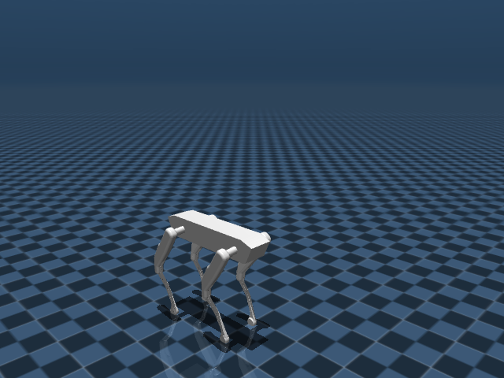

# Custom quadruped locomotion (MuJoCo)



Train a **custom 12-DoF quadruped** (not Unitree) to track velocity commands with PPO.

**URDF → MuJoCo MJCF → Gymnasium env → Stable-Baselines3 PPO → ONNX**

| Where | What it is for |
|---|---|
| Laptop / Mac, no NVIDIA GPU | Convert the robot, PD-stand, debug rewards, short CPU trains, play a policy |
| Google Colab T4 / L4 | The real training run |
| Isaac Sim / Isaac Lab | Not required. Optional later on a rented RTX box |

This is a [portfolio project](https://github.com/jakhon37/quad-loco). The robot meshes started from an [Isaac Lab custom-quadruped tutorial](https://www.youtube.com/watch?v=z62oU4hM1xM); the training stack here is MuJoCo so it actually runs without an RTX workstation.

## Robot

| | |
|---|---|
| DoF | 12 (hip / thigh / calf × 4) |
| Trunk mass | 9.7 kg |
| Total mass | ~22 kg |
| Stand height | ~0.65 m (PD hold, feet on the ground) |
| Control | 50 Hz joint-position PD (`kp=100`, `kv=3`, `τ≤45 N·m`) |
| Task | Track `(vx, vy, yaw_rate)` on flat ground |

Observation (48 dims): body linear velocity (3), angular velocity (3), projected gravity (3), command (3), joint pos relative to default (12), joint vel (12), last action (12).

Action (12 dims): `target = default_pose + 0.25 * action`.

## Setup

Python 3.10–3.12. On **Intel macOS**, pin MuJoCo 3.10 (3.11+ dropped x86_64 wheels).

```bash
git clone https://github.com/jakhon37/quad-loco.git
cd quad-loco
python3.12 -m venv .venv
source .venv/bin/activate
pip install -r requirements.txt
pip install -e .
export PYTHONPATH=src
```

The MuJoCo scene is already in `robot/mjcf/`. Rebuild from the URDF if you change the robot:

```bash
python -m quad_loco.convert_urdf
python scripts/stand.py          # PD hold, no learned policy
python -m pytest tests -q
```

`scripts/stand.py --viewer` opens the interactive viewer if you have a display.

## Train

**Smoke (minutes, CPU):**

```bash
python scripts/smoke.py
python scripts/train.py --config configs/ppo_cpu.yaml --timesteps 4096 --run-name smoke
```

**Overnight laptop (CPU, easy forward-only commands):**

```bash
python scripts/train.py --config configs/ppo_cpu.yaml --run-name cpu_easy
```

Verified on an Intel Mac with no GPU: PD stand holds at **0.62 m**, tests pass, PPO runs at **~640 FPS**, ONNX matches PyTorch to `3e-8`. A few thousand CPU steps already survive a 20 s stand. A forward walk needs the Colab run (~1.5M steps).

**Colab (the practical training run):**

[](https://colab.research.google.com/github/jakhon37/quad-loco/blob/main/notebooks/colab_train.ipynb)

1. Open the badge (or `notebooks/colab_train.ipynb`) and set Runtime → **T4 GPU**.
2. Run all cells. The first cell clones this repo into `/content/quad-loco` (opening the notebook from GitHub does not copy the rest of the project).

```bash
pip install -r requirements.txt
python -m quad_loco.convert_urdf
python scripts/train.py --config configs/ppo_colab.yaml --run-name colab_easy
```

Physics stays on CPU even on Colab; the GPU only accelerates PPO. 1.5M steps with 8 env processes is a few hours on a T4.

## Eval / export

```bash
python scripts/eval.py --model logs/cpu_easy/final_model.zip --easy --command 0.5 0 0 --video videos/walk.mp4
python scripts/export_onnx.py --model logs/cpu_easy/final_model.zip --out logs/cpu_easy/policy.onnx
```

## Layout

```
robot/          URDF, STL meshes, generated MJCF
src/quad_loco/  env, URDF converter, ONNX export
scripts/        stand / train / eval / export / smoke
configs/        PPO hyperparameters (CPU and Colab)
notebooks/      Colab training notebook
tests/          env + model smoke tests
```

## Status

Done:

- Custom robot in MuJoCo with a holdable standing pose
- Velocity-tracking Gymnasium env
- Train / eval / ONNX pipeline
- Colab notebook for GPU PPO

Next slices worth adding:

- Rough terrain and push recovery
- A ROS 2 node that runs the ONNX policy (fits a Jetson stack)
- Optional Isaac Lab comparison on a rented RTX box
