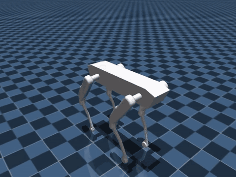
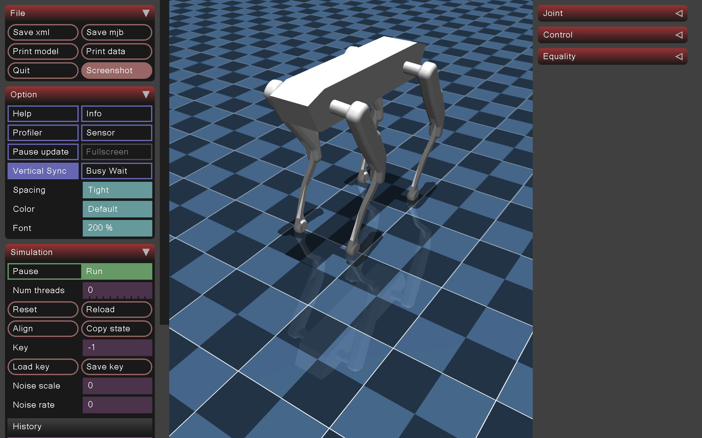

# quad-loco

Velocity-tracking locomotion for a custom 12-DoF quadruped in [MuJoCo](https://mujoco.org/). A PPO policy (Stable-Baselines3) outputs joint targets at 50 Hz; a PD controller applies torques. Export is ONNX.

No NVIDIA GPU is required. Physics and the MLP both run on CPU.

<p align="center">
  
</p>

<p align="center">
  <b>1.5M-step PPO</b> · command <code>v_x = 0.5</code> m/s
  · mean <code>|v_x − cmd| = 0.045</code> m/s
  · <a href="docs/walk.mp4">mp4</a>
</p>

```
URDF → MJCF → Gymnasium env → PPO → eval / video → ONNX
```

Details: **[docs/OVERVIEW.md](docs/OVERVIEW.md)**.

## Robot

| | |
|---|---|
| DoF | 12 (hip, thigh, calf × 4) |
| Mass | ~22 kg (trunk 9.7 kg) |
| Stand height | ~0.65 m |
| Control | 50 Hz joint-position PD (`kp=100`, `kv=3`, `τ ≤ 45 N·m`) |
| Task | Track base velocity `(v_x, v_y, ω_z)` on flat ground |

**Observation** (48): body linear velocity (3), angular velocity (3), projected gravity (3), command (3), joint position relative to default (12), joint velocity (12), last action (12).

**Action** (12): `q_target = q_default + 0.25 · a`, `a ∈ [-1, 1]`.

Meshes and URDF are adapted from a public custom-quadruped model; this repository is the MuJoCo training and export stack.

PD stand in the interactive MuJoCo viewer — no learned policy, default pose held by PD:



```bash
python scripts/stand.py --viewer
```

Close the window to exit. Headless `python scripts/stand.py` is the pass/fail check.

## Results

Trained locally on CPU with `configs/ppo_cpu.yaml` (~48 min, ~550 fps).

| | 8k smoke | 1.5M `local_walk` |
|---|---|---|
| Eval episode length | short | **1000 / 1000** (20 s, no fall) |
| Mean eval return | ~260 | **~2400** |
| Mean `|v_x − 0.5 m/s|` | 0.50 m/s | **0.045 m/s** |

Eight thousand steps is enough to stand. On the order of **1.5×10^6** steps is enough to track a forward command and step. Clip above: [docs/walk.gif](docs/walk.gif) / [docs/walk.mp4](docs/walk.mp4).

## Setup

Python 3.10–3.12. On Intel macOS, MuJoCo must be **3.10.x** (later wheels dropped x86_64).

```bash
git clone https://github.com/jakhon37/quad-loco.git
cd quad-loco
python3.12 -m venv .venv
source .venv/bin/activate
pip install -r requirements.txt
pip install -e .
export PYTHONPATH=src
```

The scene in `robot/mjcf/` is ready to use. Rebuild after changing the URDF:

```bash
python -m quad_loco.convert_urdf
python scripts/stand.py          # PD hold (no learned policy)
python -u scripts/check.py       # timed imports + env step (no trained policy)
python -u scripts/check.py --render
python -m pytest tests -q
```

## Train

Training is **optional and local-first**. A 1.5M-step run is on the order of 30–40 minutes on a laptop CPU. Google Colab is not required.

**Local**

```bash
python scripts/train.py --config configs/ppo_cpu.yaml --timesteps 8192 --run-name smoke
python scripts/train.py --config configs/ppo_cpu.yaml --run-name local_walk
```

**Colab (optional)** — unattended job, extra CPU cores for 8 parallel envs (`configs/ppo_colab.yaml`). A GPU runtime is unnecessary. Colab **Python 3.13** can hang on `import stable_baselines3`; if `scripts/check.py` sits more than about a minute, use local Python 3.12.

[](https://colab.research.google.com/github/jakhon37/quad-loco/blob/main/notebooks/colab_train.ipynb)

The first notebook cell clones this repo. A CPU runtime is enough.

Console: progress bar plus one line every few rollouts (`rew`, `len`, `ev`, `kl`, `ent`). Full metrics:

```
logs/<run>/progress.csv
logs/<run>/events.out.tfevents*
logs/<run>/eval/evaluations.npz
```

```bash
tensorboard --logdir logs/<run>
```

`--verbose 1` prints the full Stable-Baselines3 tables.

## Eval and export

`--run-name` must match the zip you load. Smoke writes `logs/smoke/final_model.zip`; a full run writes `logs/local_walk/final_model.zip`.

```bash
python scripts/eval.py --model logs/local_walk/final_model.zip --easy --command 0.5 0 0 --video videos/walk.mp4 --max-seconds 6 --render-every 2
python scripts/export_onnx.py --model logs/local_walk/final_model.zip --out logs/local_walk/policy.onnx
```

Keep `vecnormalize.pkl` next to the zip. Eval writes an MP4 and `*_preview.png` when rendering is available. GitHub does not play repo MP4s in the README, so the looping GIF above is the in-page preview.

## Layout

```
docs/           overview, viewer screenshot, walk gif/mp4
robot/          URDF, STL meshes, MJCF scene
src/quad_loco/  environment, converter, export
scripts/        stand, train, eval, export, check
configs/        PPO hyperparameters
notebooks/      optional Colab notebook
tests/
```

## License

MIT. See [LICENSE](LICENSE).
